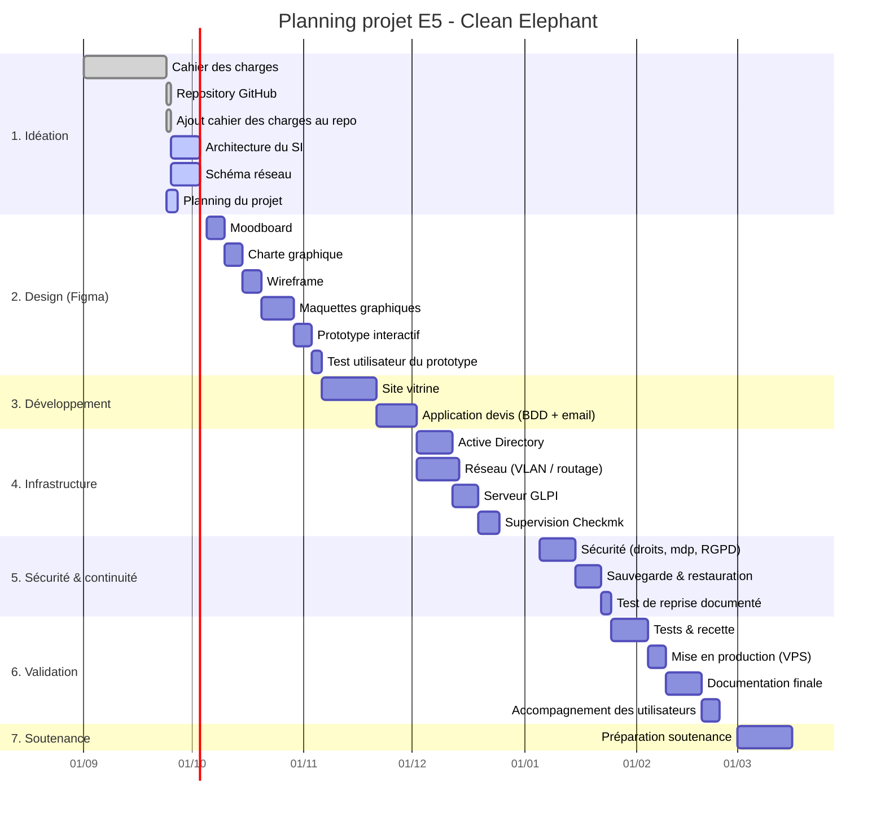

# Planning du projet — Clean Elephant (E5 BTS SIO)

> ⚠️ Dates indicatives à ajuster une fois la date de soutenance connue. Le planning couvre au minimum M+1 comme demandé par le référentiel.

## Vue d'ensemble (diagramme de Gantt)

## Jalons clés

| Jalon | Date estimée |
|---|---|
| Livrable 1 (Idéation) | Fin septembre 2026 |
| Maquette Figma validée | Fin octobre 2026 |
| Site vitrine développé | Mi-novembre 2026 |
| Infrastructure (AD/GLPI/Checkmk) opérationnelle | Fin décembre 2026 |
| Sauvegarde + test de reprise documenté | Fin janvier 2027 |
| Mise en production | Début février 2027 |
| Documentation finale | Mi-février 2027 |
| Soutenance | Mars 2027 |

## Équipe

- **Harouna Diakité**
- **Noah Fine**
